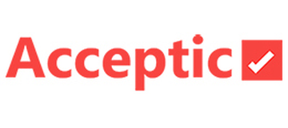
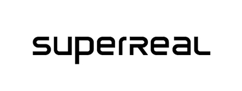
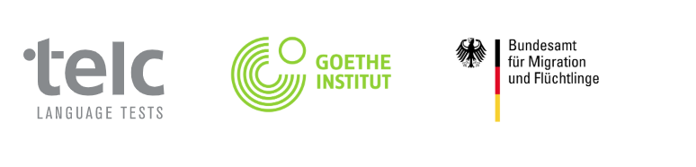

# CV - Kat Rybalko

I am a developer who enjoys writing Javascript and creating websites, using up-to-date technologies.

My goal is to become awesome at writing simple, scalable and readable code - through practice, learning and applying different programming paradigms.

### SKILLS

I've been worked on more than 20 projects for clients, using the following technologies:

HTML, CSS, JS (ES5, ES6), Less, SCSS, Gulp, Webpack, AJAX, React JS, SVG, ARIA, RESTful APIs, Bootstrap, csswizardry-grids

##### Methodologies / Practices:

Progressive Enhancement, BEM, OOP, Agile/Scrum,Continuous Integration, Code Review, Branch-per-task.

---

### EXPERIENCE

#### Front-End Developer (Apr 2018 - Sep 2018)
Acceptic - dedicated software development teams (from 2019: Yael Acceptic - Nearshore Outstaffing be Yael Group).

Project "Sigmento" |  Product Information as a Service

My direct Responsibilities were:
- Worked in an great development team from Israel.
- Implementing web services components.
- Dealing with the layout of complex designs.
- Developing new features.
- Supporting the existing code and troubleshooting.
- RESTful services + JSON;
- using ReactJS, Redux, and following tools like Sketch, Git, Swagger

:octocat:

#### Front-End Developer (June 2015 - Sep 2017)
- worked in an amazing development team with a wide range of projects using up-to-date technologies
- developed unique, individual eLearning products, booking portals, event management projects
- redesigned fashion educational platform on React
- maintained existing projects

Projects:
- "Stylevisit" |  Salon Management ♥
- "ASK EDUCATION eACADEMY" | Education Platform for Hairdressers ♥
- "tm-drive Navigator" |  admin react app ♥
- etc.

:octocat:

#### Front-End Developer (Dec 2015 - Sep 2016) 8-Month Contract

- worked for an eCommerce agency with more than 15 years of experience in the online business
- maintained existing projects for fashion and lifestyle brands
- redesigned online shops using OXID eShop platform and template language Smarty

Projects:
- "AWG Mode" |  Mode für Damen, Herren und Kinder ♥
- "Geliebtes Zuhause" |  Online-Shop, Wohnaccessoires & Geschirr ♥

:octocat:

#### Markup Engineer (July 2014 - May 2015)
- I've worked for an outsourcing company which provides comprehensive services in the field of web development and outstaffing for digital agencies from United States, Australia, Canada etc.
- Created bunch of adaptive/responsive websites from scratch

---

### EDUCATION
- Master of Applied Linguistics - Donetsk National University
- Bachelor in Philology - Donetsk National University

---

### CERTIFICATIONS

- **German course Level C1**, VHS Berlin (2020)
- **Zertifikat Integrationskurs**, Bundesamt für Migration und Flüchtlinge (Nov 2019)
- **Zertificat "Deutsch-Test für Zuwanderer" (DTZ)**,
telc GmbH - The European Language Certificates (Sep 2019)
- **Java Script advanced course**, HTML Academy (2016)
- **Java Script basic course**, HTML Academy (2015)
- **HTML & CSS advanced course**, HTML Academy (2015)
- **Creating web interfaces with HTML & CSS**, HTML Academy (2014)
- **Goethe-Zertifikat A1 Start Deutsch 1 (German)**, Goethe Institut Kiew (2016)

